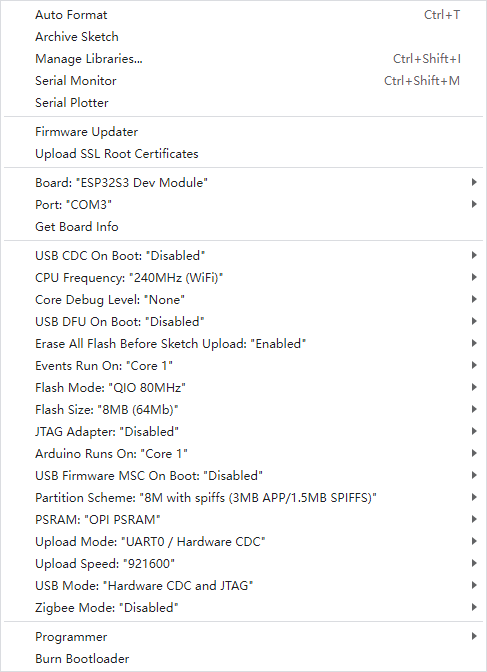
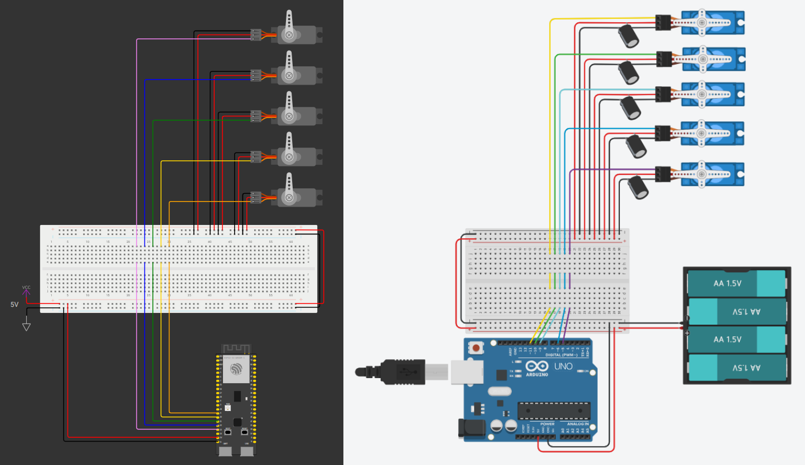

# HandMirror-AI 🤖🖐️

[](LICENSE)
[](https://github.com/Akihito44/HandMirror-AI/issues)
[](https://www.arduino.cc/en/software/)
[](https://www.python.org/downloads/)
[](https://opencv.org/)
[](https://mediapipe.dev/)

*Read this in other languages: [Italian](README.md).*

## 📖 Table of Contents
- [✨ Features](#features)
- [🎥 Demo](#demo)
- [🧰 Required Components](#required-components)
- [⚙️ Installation](#installation-and-configuration)
- [🚀 Usage](#project-execution)
- [🧠 Technical Notes](#technical-notes)
- [🔍 Troubleshooting](#troubleshooting)
- [📄 License](#license)

## Features
- Real-time hand tracking at 30 FPS
- Powered by Artificial Intelligence
- Automatic servo motor calibration
- Multi-platform support

## Demo
An AI system implementation using MediaPipe and ESP32 to control robotic fingers through gesture recognition, replicating human movements on a robotic hand.


## Required Components
### Hardware
- **Required:**
   | Component    | Quantity | Specifications       |
   | ------------ | :------: | -------------------- |
   | ESP32-S3     | 1        | 240MHz, 512KB PSRAM  |
   | SG90 Servo   | 5        | 180°, 0.12s/60°      |
   | Power Supply | 1        | 5V                   |
   | Jumper Wires | ~20      | M-M and M-F          |
   | Webcam       | 1        | Built-in or USB      |
- **Optional:**
   | Component   | Quantity | Specifications |
   | ----------- | :------: | -------------- |
   | Breadboard  | 1        | Full size      |
   | Capacitors  | 5        | 480μF, 16V     |

### Software
  - Python 3.11
  - Python Libraries: OpenCV, MediaPipe, PySerial
  - Arduino IDE (for ESP32 firmware)

## Installation and Configuration
### Repository Download
- **Via git terminal:**
   ```bash
   git clone https://github.com/Akihito44/HandMirror-AI.git
   cd HandMirror-AI
   ```
- **ZIP Download:**
  - Download from GitHub: [click here](https://github.com/Akihito44/HandMirror-AI/archive/refs/heads/main.zip)
  - Extract to destination folder

### Python Virtual Environment Setup
1. **Create virtual environment:**
   ```bash
   python -m venv myenv
   ```

2. **Activate environment:**
   - **Windows:**
     ```bash
     .\myenv\Scripts\activate
     ```
   - **macOS/Linux:**
     ```bash
     source myenv/bin/activate
     ```

3. **Install dependencies:**
   ```bash
   pip install pyserial opencv-python mediapipe=0.10.5
   ```

### Arduino IDE Setup
1. **Update board manager:**
   - `File -> Preferences -> Additional Boards Manager URLs`
   - Add this URL:  
   ```
   https://raw.githubusercontent.com/espressif/arduino-esp32/gh-pages/package_esp32_index.json
   ```
2. **Add ESP32 boards:**
   - `Tools -> Board -> Boards Manager`
   - Search for `esp32`
   - Install `Espressif Systems` package
3. **Select board:**
   - `Tools -> Board -> esp32`
   - Select `ESP32S3 Dev Module`
4. **Select port:**
   - `Tools -> Port`
   - Select serial port (COMx on Windows or /dev/ttyUSB* on Linux)
5. **Configure board parameters:**
   - In `Tools` select board parameters
   - Example for *Freenove ESP32-S3-WROOM*:  
   

### Driver Installation (Important)
- **Windows:**
  - Download [CH343 driver](https://www.wch.cn/downloads/CH343SER_EXE.html)
  - Filename: `CH343SER.EXE`
- **Mac:**
  - Download [CH343 driver](https://www.wch.cn/downloads/CH343SER_EXE.html)
  - Filename: `CH34XSER_MAC.ZIP`
- **Linux:**
  - Download [CH343 driver](https://github.com/Akihito44/HandMirror-AI/tree/main/CH343/Linux/ch343ser_linux)
  - Follow instructions in `README.md`

### ESP32 Configuration
1. **Connect servos** to pins defined in `Arduino-code.ino`:
   ```
   Thumb: GPIO9
   Index: GPIO10
   Middle: GPIO11
   Ring: GPIO12
   Pinky: GPIO13
   ```
   
2. **Upload firmware:**
   - Open `Arduino-code.ino` in Arduino IDE
   - Select "ESP32-S3 Dev Module" board
   - Set correct serial port (e.g. `COM3` on Windows)
   - Compile and upload code

## Project Execution
### Basic Mode (Vision Only)
- **Run Python script:**
   ```bash
   python Test-HandMirror-AI.py
   ```
- **Output:** Window with landmark overlay and calculated angles

### Complete Mode (Robot Control)
1. **Configure serial port (if needed):**
   - Modify `port='COM3'` in `HandMirror-AI.py` for your system
   - Modify `baudrate=115200` in `HandMirror-AI.py` for your board
2. **Run Python script:**
   ```bash
   python HandMirror-AI.py
   ```
3. **Usage:**
   - Show your hand to the webcam
   - Detected fingers will control servos (1 = bent, 0 = extended)
   - Press `Q` to quit

## Technical Notes
### Artificial Intelligence
1. **Recognition Pipeline:**
   ```mermaid
   graph LR
   A[Webcam Input] --> B[Landmark Detection]
   B --> C[Gesture Classification]
   C --> D[Serial Command Generation]
   D --> E[Servo Control]
   ```
2. **MediaPipe Hands:**
   - Lightweight CNN model (Convolutional Neural Network)
   - Output: 21 3D landmarks per hand
   - Accuracy >95% on internal datasets
   - Latency: ~8ms on modern CPU

### Code Architecture
| Component     | Technology        | Function                             |
| ------------ | ---------------- | ------------------------------------ |
| Vision Engine | OpenCV + MediaPipe | Hand landmark extraction             |
| Serial Bridge | PySerial         | Bidirectional ESP32 communication    |
| Control Logic | Custom Python    | Landmark to servo angle conversion   |
| Firmware     | Arduino C++      | PWM generation for servos            |

### Known Limitations
- **Total Latency:** ~120ms (webcam 60ms + processing 40ms + serial 20ms)
- **Angular Resolution:** 1° (servo hardware limit)
- **Light Conditions:** Reduced performance under <300 lux

### Project Structure
```
HandMirror-AI/
|
├── HandMirror-AI.py       # Main script for hand tracking and serial communication
├── Test-Mirror-AI.py      # Test script for hand tracking only
├── Arduino-code/
|   └── Arduino-code.ino   # Servo motor control firmware
├── images/
|   ├── Arduino_Configuration.png
|   ├── arduino.png
|   └── esp32.png
├── CH343/
|   ├── Linux/
|   |   ├── ch343ser_linux/
|   |   |   ├── driver/
|   |   |   |   ├── .ch343.ko.cmd
|   |   |   |   ├── .ch343.mod.cmd
|   |   |   |   ├── .ch343.mod.o.cmd
|   |   |   |   ├── .ch343.o.cmd
|   |   |   |   ├── .Module.symvers.cmd
|   |   |   |   ├── .modules.order.cmd
|   |   |   |   ├── ch343.c
|   |   |   |   ├── ch343.h
|   |   |   |   ├── ch343.ko
|   |   |   |   ├── ch343.mod
|   |   |   |   ├── ch343.mod.c
|   |   |   |   ├── ch343.mod.o
|   |   |   |   ├── ch343.o
|   |   |   |   ├── Makefile
|   |   |   |   ├── Module.symvers
|   |   |   |   └── modules.order
|   |   |   └── README.md
|   |   ├── ch343ser_linux.zip
|   |   └── Linux.png
|   ├── MAC/
|   |   ├── CH34XSER_MAC.ZIP
|   |   └── ReadMeFirst.txt
|   └── Windows/
|       └── CH343SER.EXE
├── README.md
└── LICENSE
```

## Troubleshooting
- **Serial Port Error:**
  - Verify ESP32 is connected and recognized
  - Ensure serial drivers are installed (CH343 driver: [download here](https://www.wch-ic.com/search?t=all&q=ch343))
  - Close other programs using serial port (e.g., Arduino Serial Monitor)
  - Close other programs using webcam
- **Missing Dependency:**
  ```bash
  pip install --upgrade [library_name]
  ```

## License
Distributed under MIT License. See [LICENSE](LICENSE) for details.