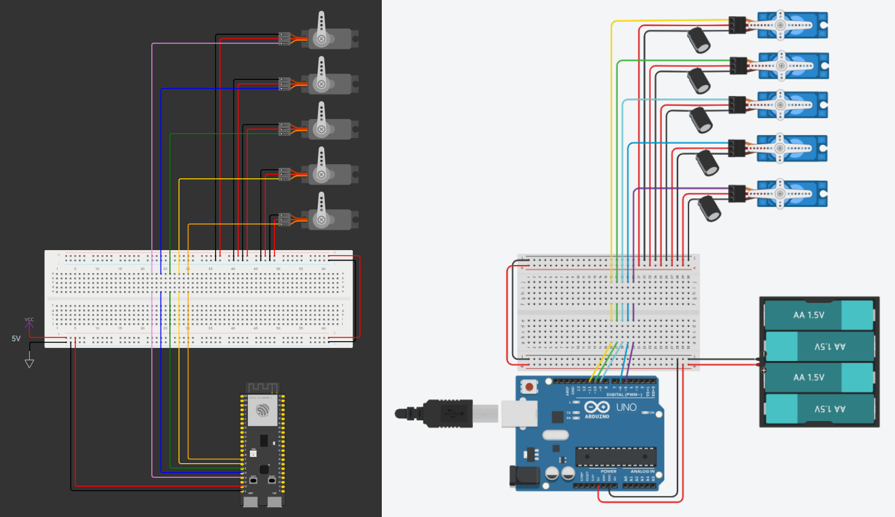

# HandMirror-AI 🤖🖐️

[](LICENSE)
[](https://github.com/Akihito44/HandMirror-AI/issues)
[](https://www.arduino.cc/en/software/)
[](https://www.python.org/downloads/)
[](https://opencv.org/)
[](https://mediapipe.dev/)

*Read this in other languages: [English](README.EN.md).*

## 📖 Indice
- [🎥 Panoramica](#panoramica)
- [🔥 Funzionalità](#funzionalità)
- [🛠️ Componenti necessari](#componenti-necessari)
- [⚙️ Installazione](#installazione-e-configurazione)
- [🚀 Esecuzione](#esecuzione-del-progetto)
- [🧠 Note Tecniche](#note-tecniche)
- [🔍 Risoluzione Problemi](#risoluzione-problemi)
- [📄 Licenza](#licenza)

## Panoramica
HandMirror-AI è un sistema di controllo in real-time di una mano robotica basato su Intelligenza Artificiale. Utilizzando MediaPipe per il riconoscimento delle gesture e un modulo ESP32-S3 per pilotare i servo, riproduci in modo fedele i movimenti della tua mano su dita robotiche.


## Funzionalità
- 🎯 **Tracking mano in tempo reale** a 30 FPS
- 🤖 **IA avanzata** con pipeline MediaPipe e reticolo CNN ottimizzato
- ⚙️ **Calibrazione automatica** dei servo-motori per massima precisione
- 🌐 **Cross-platform**: Windows, macOS, Linux

## Componenti necessari
### Hardware richiesto
| Componente    | Q.tà | Specifiche                   |
| ------------- | :--: | ---------------------------- |
| ESP32-S3      | 1    | 240MHz, 512KB PSRAM          |
| Servo SG90    | 5    | 180°, 0.12s/60°              |
| Alimentazione | 1    | 5 V DC                       |
| Jammer        | ~20  | M-M e M-F                    |
| Webcam        | 1    | USB o integrata (>=1280x720) |

### Hardware opzionale
| Componente   | Q.tà | Specifiche |
| ------------ | :--: | ---------- |
| Breadboard   | 1    | Full size  |
| Condensatori | 5    | 480μF, 16V |

### Software richiesto
  - **Python 3.11** + librerie: `opencv-python`, `mediapipe==0.10.5`, `pyserial`
  - **Arduino IDE** (>= v2.3.6) con supporto **ESP32**

## Installazione e Configurazione
### Download Repository
- **Tramite git nel terminale**:
   - Aprire il terminale nella cartella di destinazione.
   - Digitare i seguenti comandi:
      ```bash
      git clone https://github.com/Akihito44/HandMirror-AI.git
      cd HandMirror-AI
      ```
- **Download ZIP**:
  - Scaricare il file zip da github: [scarica qui](https://github.com/Akihito44/HandMirror-AI/archive/refs/heads/main.zip).
  - Estrarre il contenuto nella cartella di destinazione.

### Configurazione Ambiente Virtuale Python
1. **Crea un ambiente virtuale**:
   ```bash
   python -m venv myenv
   ```

2. **Attiva l'ambiente**:
   - **Windows**:
     ```bash
     .\myenv\Scripts\activate
     ```
   - **macOS/Linux**:
     ```bash
     source myenv/bin/activate
     ```

3. **Installa le dipendenze**:
   ```bash
   pip install pyserial opencv-python mediapipe=0.10.5
   ```

### Configurazione Ambiente Arduino IDE
1. **Aggiornare gestore schede**:
   - `File -> Preferences -> Additional Boards Manager URLs`.
   - Aggiungere il seguente URL:  
   ```
   https://raw.githubusercontent.com/espressif/arduino-esp32/gh-pages/package_esp32_index.json
   ```
2. **Aggiungere gestore schede ESP32**:
   - `Tools -> Board -> Boards Manager`.
   - Cercare `esp32`.
   - Installare il gestore di `Espressif Systems`.
3. **Selezionare la scheda**:
   - `Tools -> Board -> esp32`.
   - Selezionare la scheda `ESP32S3 Dev Module`.
4. **Selezionare la porta**:
   - `Tools -> Port`.
   - Selezionare la porta seriale COMx (Windows) o /dev/ttyUSB* (Linux).
5. **Impostare i parametri della scheda**:
   - In `Tools` selezionare i parametri della scheda.
   - Esempio dei parametri della scheda *Freenove ESP32-S3-WROOM*:  
   

> ⚠️ Non dimenticare di installare i driver CH343 se il sistema non riconosce l’ESP32:
> - **Windows**:
>   - Scaricare  [driver CH343](https://www.wch.cn/downloads/CH343SER_EXE.html).
>   - Nome file: `CH343SER.EXE`.
> - **MAC**:
>   - Scaricare  [driver CH343](https://www.wch.cn/downloads/CH343SER_EXE.html).
>   - Nome file: `CH34XSER_MAC.ZIP`.
> - **Linux**:
>   - Scaricare [driver CH343](https://github.com/Akihito44/CH343-serial-driver/tree/main/Linux/ch343_ser_linux).
>   - Seguire le istruzioni contenute nel file `README.md`.

### Configurazione ESP32
1. **Collega i servo motori** ai pin definiti in `Arduino-code.ino`:
   ```
   Pollice: GPIO9
   Indice:  GPIO10
   Medio:   GPIO11
   Anulare: GPIO12
   Mignolo: GPIO13
   ```
   
2. **Carica il firmware**:
   - Apri `Arduino-code.ino` con IDE Arduino.
   - Seleziona la scheda "ESP32-S3 Dev Module".
   - Imposta la porta seriale corretta (es: `COM3` su Windows).
   - Compila e carica il codice.

## Esecuzione del Progetto
### Modalità Base (Solo Visione)
- **Avvia lo script Python**:
   ```bash
   python Test-HandMirror-AI.py
   ```
- **Output**: Finestra con overlay landmark e angoli calcolati.

### Modalità Completa (Controllo Robot)
1. **Configura la porta seriale** (se necessario):
   - Modifica `port='COM3'` in `HandMirror-AI.py` in base al tuo sistema.
   - Modifica `baudrate=115200` in `HandMirror-AI.py` in base alla tua scheda.
2. **Avvia lo script Python**:
   ```bash
   python HandMirror-AI.py
   ```
3. **Utilizzo**:
   - Mostra la mano alla webcam.
   - Le dita rilevate controllano i servo motori (1 = piegato, 0 = disteso).
   - Premi `Q` per uscire.

## Note Tecniche
### Intelligenza Artificiale
1. **Pipeline di Riconoscimento**:
   ```mermaid
   graph LR
   A[Input Webcam] --> B[Landmark Detection]
   B --> C[Gesture Classification]
   C --> D[Serial Command Generation]
   D --> E[Servo Control]
   ```
2. **MediaPipe Hands**:
   - Modello lightweight CNN (Convolutional Neural Network)
   - Output: 21 landmark 3D per mano
   - Precisione 95.7% su dataset interni
   - Latenza: ~8ms su CPU moderna

### Architettura del Codice
| Componente    | Tecnologia         | Funzione                              |
| ------------- | ------------------ | ------------------------------------- |
| Vision Engine | OpenCV + Mediapipe | Estrazione landmark gestuali          |
| Serial Bridge | PySerial           | Comunicazione bidirezionale con ESP32 |
| Control Logic | Custom Python      | Conversione landmark -> angoli servo  |
| Firmware      | Arduino C++        | PWM generation per servomotori        |


### Limitazioni Note
- **Latenza Totale**: ~120ms (webcam 60ms + processing 40ms + serial 20ms).
- **Risoluzione Angolare**: 1° (limite hardware servomotori).
- **Ambienti Luminescenti**: Performance ridotte con luce <300 lux.

### Struttura del Progetto
```
HandMirror-AI/
|
├── HandMirror-AI.py       # Script principale per tracciamento mani e comunicazione seriale.
├── Test-Mirror-AI.py      # Script di test per il solo tracciamento delle mani.
├── Arduino-code/
|   └── Arduino-code.ino   # Firmware per il controllo dei servo motori.
├── images/
|   ├── Arduino_Configuration.png
|   ├── arduino.png
|   ├── circuiti.png
|   └── esp32.png
├── README.EN.md
├── README.md
└── LICENSE
```

## Risoluzione Problemi
- **Errore porta seriale**:
  - Verifica che l'ESP32 sia collegato e riconosciuto dal sistema.
  - Assicurati che i driver della porta seriale siano installati (es. driver CH343: [scarica qui](https://github.com/Akihito44/CH343-serial-driver)).
  - Chiudi altri programmi che usano la porta seriale (es: Monitor Seriale di Arduino).
  - Chiudi altri programmi che usano la webcam.
- **Dipendenza mancante**:
  ```bash
  pip install --upgrade [nome_libreria]
  ```
- **Altri problemi**:
  - Consulta la sezione [issue](https://img.shields.io/github/issues/Akihito44/HandMirror-AI).

## Licenza
Distribuito sotto licenza MIT. Vedi [LICENSE](LICENSE) per dettagli.

*Creato con ❤️ da Akihito44*
