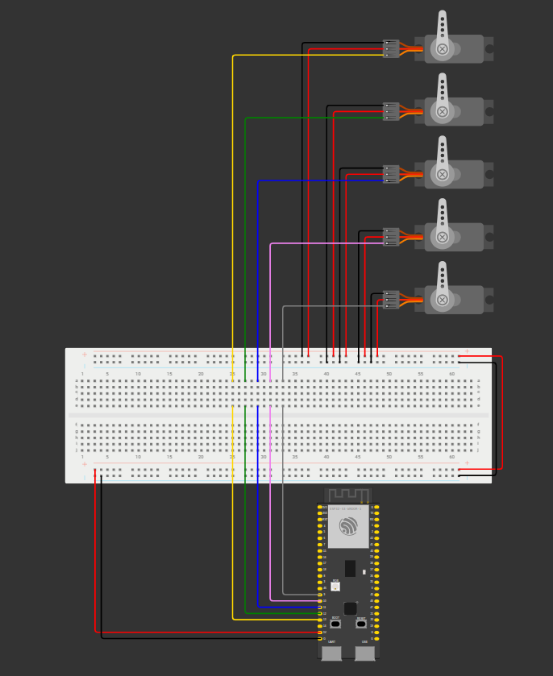
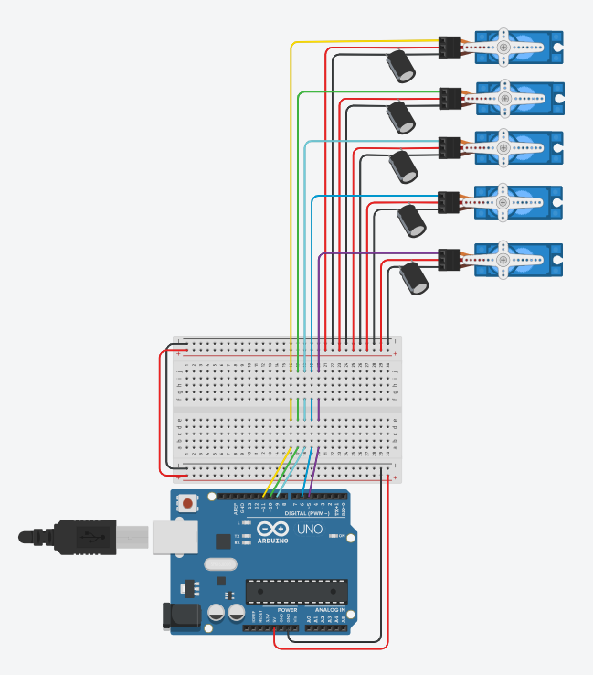

# HandMirror-AI 🤖🖐️

Progetto di controllo servo motori per dita robotiche tramite riconoscimento gesti manuali con MediaPipe e ESP32.


## Componenti Richiesti
**Necessario:**
- Modulo ESP32-S3
- 5x Servo motori (**consigliati: SG90**, qualsiasi servomotore con un angolo di rotazione di almeno 180°)
- Webcam

**Opzionale:**
- Breadbord
- Jamper (M-M e M-F)
- 5x Condensatori 480μF 16V

## Software Richiesti
  - Python 3.11
  - Librerie Python: OpenCV, MediaPipe, PySerial
  - IDE Arduino (per firmware ESP32)

## Configurazione Ambiente Virtuale Python
1. **Crea un ambiente virtuale**:
   ```bash
   python -m venv myenv
   ```

2. **Attiva l'ambiente**:
   - **Windows**:
     ```bash
     .\myenv\Scripts\activate
     ```
   - **macOS/Linux**:
     ```bash
     source myenv/bin/activate
     ```

3. **Installa le dipendenze**:
   ```bash
   pip install opencv-python mediapipe pyserial
   ```

## Setup ESP32
1. **Collega i servo motori** ai pin definiti in `Arduino-code.ino`:
   ```
   Pollice: GPIO9
   Indice:  GPIO10
   Medio:   GPIO11
   Anulare: GPIO12
   Mignolo: GPIO13
   ```
   
   
3. **Carica il firmware**:
   - Apri `Arduino-code.ino` con IDE Arduino.
   - Seleziona la scheda "ESP32-S3 Dev Module".
   - Imposta la porta seriale corretta (es: `COM3` su Windows).
   - Compila e carica il codice.

## Esecuzione del Progetto
1. **Avvia lo script Python**:
   ```bash
   python HandMirror-AI.py
   ```
2. **Configura la porta seriale** (se necessario):
   - Modifica `port='COM3'` in `HandMirror-AI.py` in base al tuo sistema.

3. **Utilizzo**:
   - Mostra la mano alla webcam.
   - Le dita rilevate controllano i servo motori (1 = piegato, 0 = disteso).
   - Premi `Q` per uscire.

## Struttura dei File
- `HandMirror-AI.py`: Script principale per tracciamento mani e comunicazione seriale.
- `Test-HandMirror-AI.py`: Script di test per il solo tracciamento delle mani.
- `Arduino-code.ino`: Firmware per il controllo dei servo motori.

## Risoluzione Problemi
- **Errore porta seriale**:
  - Verifica che l'ESP32 sia collegato e riconosciuto dal sistema.
  - Chiudi altri programmi che usano la porta seriale (es: Monitor Seriale di Arduino).
  - Chiudi altri programmi che usano la webcam.
- **Dipendenza mancante**:
  ```bash
  pip install --upgrade [nome_libreria]
  ```
  
